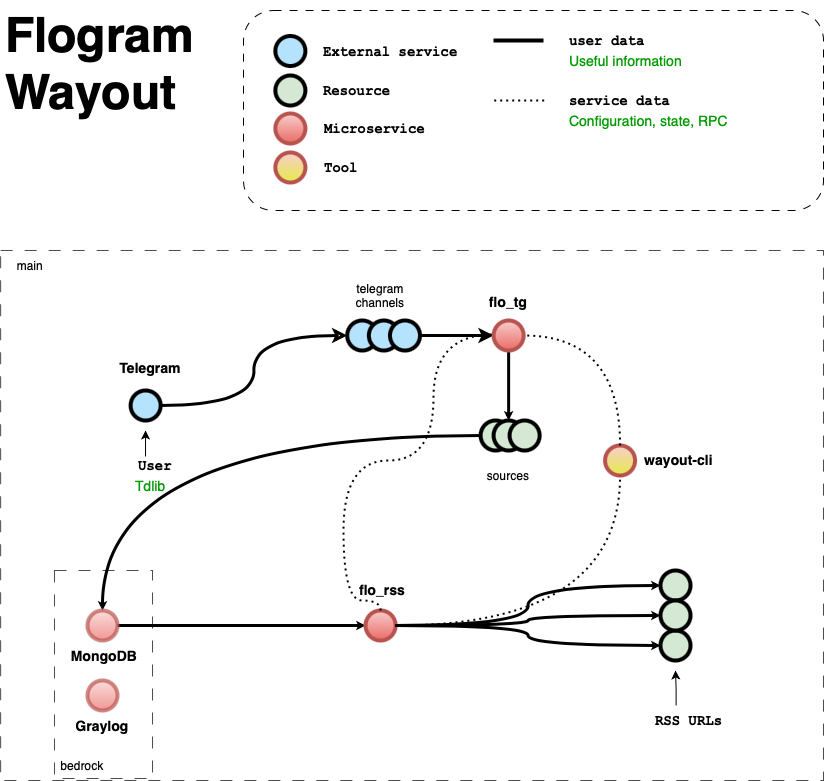

# Wayout

Read Telegram Messenger content with simple RPC API/RSS.

## Description

Semi-public ecosystems aggregate large amounts of user-generated content. For instance, Google does not index content from millions of users in Telegram Messenger's public channels.

Accessing this data from external systems presents challenges due to the non-HTTP protocol and potential _technical_ limitations imposed by the official client code for reading or searching data.

This enables access to the open information in the form of an API or URL, addressing various difficulties encountered when retrieving public channel messages from semi-public ecosystems like Telegram using native official sources (tdlib). Messages are persisted, streamed by request and have no reduntant data.

# Installation

      $ docker network create --driver bridge flogram-internal

      $ docker-compose --profile bedrock up -d

Before running Wayout, I had to:

 1. Preflight initialize graylog and provision certificate to the datanode using the web browser UI. The password for Basic Auth was printend in container log.

 2. Add **GELF TCP** source in **System > Inputs** with default port. This allows services to log messages to Graylog, which is important for error and problem tracing.

 **It is important to ensure that phone number is authorized by running flo_tg in interactive mode:**

      $ docker-compose run -it flo_tg

### Blueprint

## Configuration

I copied `.env.example` as `.env` to create configuration.

 - Wayout uses tdlib to act as a console Telegram client (flo_tg)
 
 I've [created my Telegram App](https://core.telegram.org/api/obtaining_api_id) and saved APP_ tokens given by Telegram to the `.env` file.

 - Wayout itself is compiled from source with command:

      $ docker-compose --profile main build

## Run

 - When I change `TG_PHONE` authorization in Telegram in interactive shell was required.

      $ docker-compose run -it flo_tg

When it did not ask to enter SMS code, I am ready to go in non-interactive (normal) mode:

      $ docker-compose --profile main up -d

-----

### CLI

flo_tg

      $ wayout conf

      $ wayout sources
      $ wayout sources --monitored

      $ wayout source --on 3773432
      $ wayout source --stream 3773432
      $ wayout source --off 3773432

flo_rss

      $ wayout rss

      $ wayout rss --url 3773432
      $ wayout rss --add 3773432
      $ wayout rss --rm 3773432

If monitoring was not turned on for a source, new messages are not saved/streamed.

### Connectivity

Basic `docker-compose.yml` only exposes TCP/UDP ports of Graylog and its Datanode to host.

Containers linked to the `flogram-internal` bridged network can reach each other.

### Development

***Devcontainers** extension must be used to edit, test, debug code in **Visual Studio Code** editor.

#### Extending

To programmaticaly receive messages saved in monitored sources, a gRPC client could be written.

[flogram-lab/lazyr](https://github.com/flogram-lab/lazyr) is an example in Swift.

 `github.com/flogram-lab/wayout/flo_tg/proto` is to be imported in Go programs.

#### Compile gRPC changes

Compiling protobuf files and updating go/swift sources is done inside docker. Simply:

      $ docker-compose --profile protoc up